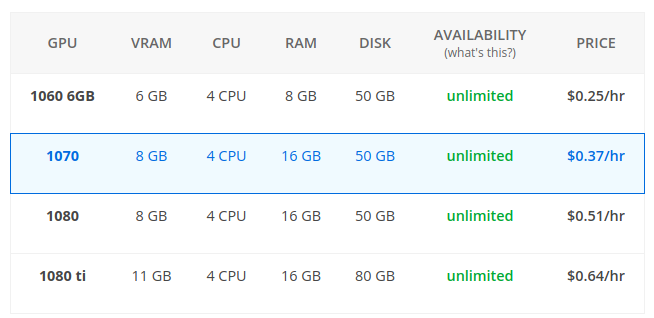

# darknet_captcha
项目基于darknet开发了一系列的快速启动脚本，旨在使用图像识别的新手或者开发人员能够快速的搭建一个目标检测的项目。

# 1. 项目结构
项目分为三部分：darknet、extent、app
1. darknet
这部分没有作任何改动。
2. extent
扩展部分，新增了生成目标检测样本的程序、快速生成配置、识别demo和api程序。
3. app
每一个新的识别需求都以app区分，其中包含配置文件、样本和标签文件。

# 2. 快速开始一个例子
darknet实际上给我们提供了一系列的深度学习算法，我们要做的就是使用比较简单的步骤来调用darknet训练我们的识别模型。
推荐使用的操作系统是`ubuntu`，遇到的坑会少很多。  
如果使用windowns系统，需要先安装`cygwin`，参考我的博客：[如何在windowns上使用make等Unix系命令？教你安装cygwin](https://blog.csdn.net/weixin_39198406/article/details/83020632)
下面的步骤都通过了`ubuntu16.04`测试。  
## 2.1 下载项目
```
git clone darknet_captcha
```
## 2.2 编译darknet
下载darknet项目，覆盖darknet目录：  
```
git clone https://github.com/pjreddie/darknet.git
```
进入`darknet`目录，修改`darknet/Makefile`配置文件  
```
cd darknet
vim Makefile
```
如果使用GPU这里GPU=1，如果使用CPU这里GPU=0，不建议使用CPU进行训练，因为使用CPU耗时会非常久。  
如果你需要租用临时（且价格低）的GPU主机进行测试，可以点击这里，后面我会介绍一些推荐的服务。  
```
GPU=1
CUDNN=0
OPENCV=0
OPENMP=0
DEBUG=0
```
然后就可以编译darknet：  
```
make
```
>如果在编译过程中会出错，可以在darknet的issue找一下解决办法，也可以发邮件找我要旧版本的darknet。

## 2.3 安装python3环境
使用pip执行下面的语句：  
```
pip install -r requirement.txt
```
确保你的系统上已经安装了tk：
```
sudo apt-get install python-tk
```
## 2.4 生成基本配置
进入根目录：  
```
cd darknet_captcha
```
运行下面的程序生成一个应用的基本配置，如果你对darknet相关配置有一定的了解，可以直接打开文件修改参数的值，这里我们保持原样即可。  
```
python3 extend/generate_config_file.py my_captcha
```
my_captcha可以换成其他的名称，

## 2.5 生成样本
生成样本使用另外一个项目 [nickliqian/generate_click_captcha](https://github.com/nickliqian/generate_click_captcha)  
这里我已经集成进去了，分别指定应用名称、字体、验证码文字映射字典和生成数量，然后运行就可以生成指定数量的样本了：  
```
python3 extend/generate_click_captcha.py  my_captcha extend/msyh.ttf extend/chinese_word.json 300
```
生成的样本和标签文件都在应用目录下面的。  

# 2.6 划分训练集和验证集
划分训练集和验证集，同时对标签的值进行转换：  
```
python3 extend/output_label.py my_captcha
```

# 2.7 开始训练
到这里，我们要准备的东西还差一样，那就是darknet提供的预训练模型，使用下面的地址下载：  
```
wget https://pjreddie.com/media/files/darknet53.conv.74
```
在根目录下，执行下面的命令开始训练：
```
./darknet/darknet detector train app/my_captcha/my_captcha.data app/my_captcha/my_captcha_train.yolov3.cfg darknet53.conv.74
```
训练过程中模型会每一百次迭代储存一次，储存在`app/my_captcha/backup/`下，可以进行查看。  
# 2.8 识别效果
大概1.5小时，训练迭代到1000次，会有比较明显的效果，我们找一张验证集的图片进行识别测试：  

这里的参数分别是：图片路径、网络配置路径、模型路径、数据配置路径：  
```
python3 extend/rec.py app/my_captcha/images_data/JPEGImages/0_15463317589942513.jpg app/my_captcha/my_captcha_train.yolov3.cfg app/my_captcha/backup/my_captcha_train.backup app/my_captcha/my_captcha.data
```
可以看到1000次的时候效果还不错  
迭代300次：
  
迭代800次：
  
迭代1000次：
  

## 3 使用阿里云OSS上传图片
```
python3 upload.py app/my_captcha/images_data/JPEGImages/1_15463317590530567.jpg
python3 upload.py text.jpg
```

## GPU云推荐
使用租用 vectordash GPU云主机，ssh连接集成了Nvidia深度学习环境的ubuntu16.04系统；    
vectordash提供了一个客户端，具备远程连接、上传和下载文件、管理多个云主机等。  
下面是几种显卡的租用价格：  

创建实例后，面板会提供一个秘钥，输入秘钥后，就可以使用客户端操作了：  
```
# 安装客户端
pip install vectordash --upgrade
# 登录
vectordash login
# 列出主机
vectordash list
# ssh登录
vectordash ssh <instance_id>
# 打开jupyter
vectordash jupyter <instance_id>
# 上传文件
vectordash push <instance_id> <from_path> <to_path>
# 下载文件
vectordash pull <instance_id> <from_path> <to_path>
```
由于vectordash主机在国外，所以上传和下载都很慢，建议临时租用一台阿里云竞价突发型实例（约7分钱一小时）作为中转使用。

## 报错解决办法
1. UnicodeEncodeError: 'ascii' codec can't encode character '\U0001f621' in posit
[参考链接](https://blog.csdn.net/u011415481/article/details/80794567)
2. pip install, locale.Error: unsupported locale setting
[参考链接](https://blog.csdn.net/qq_33232071/article/details/51108062)